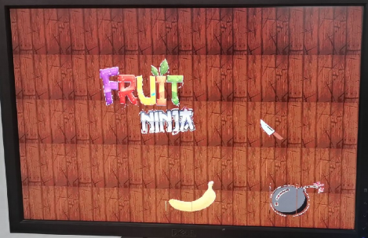
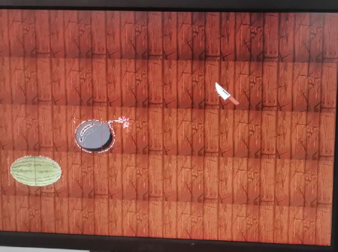
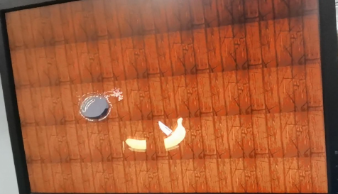

# Fruit Ninja Game Design Based on Digital System
> Project for Digital Logic Design Course, ZJU2020

An game written in *verilog* to port Fruit Ninja game to Xilinx Kintex-7 Board. PS2 Keyboard, VGA display and PS2 Mouse drivers are developed for this platform.

## Demo:

Please give it a star if you are benefited.

